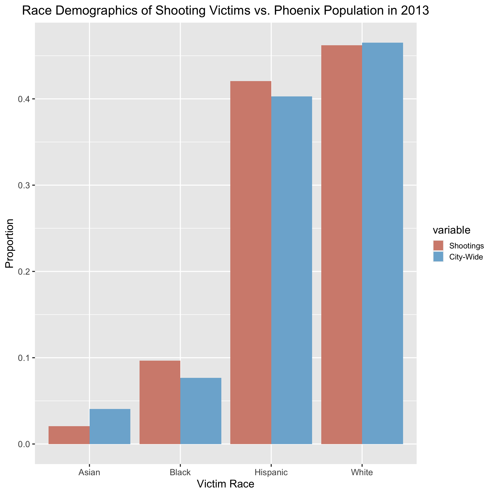
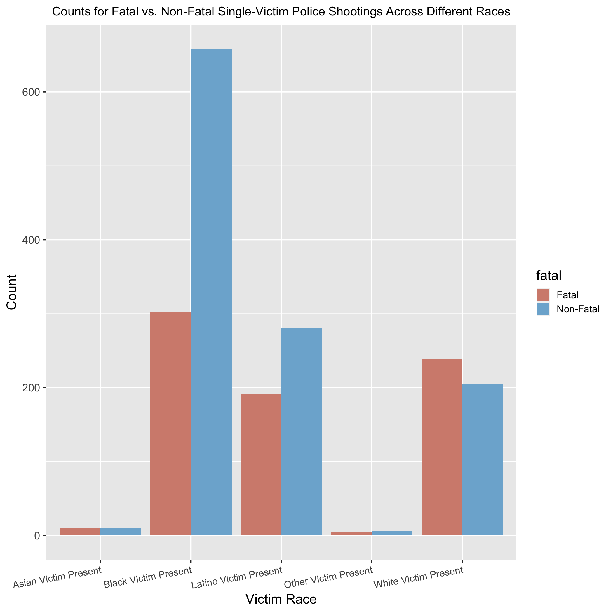
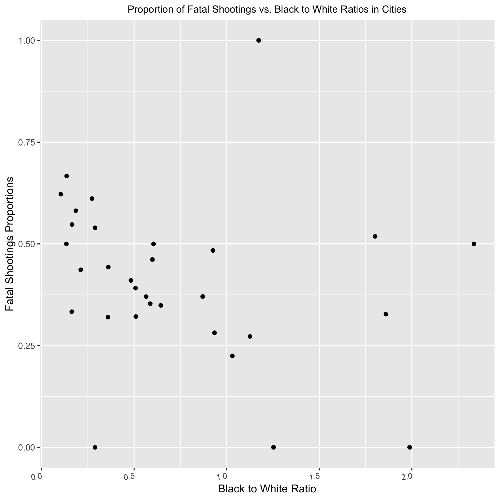

```{r setup, include = FALSE}
knitr::opts_chunk$set(echo = FALSE, warning = FALSE, message = FALSE)
```

```{r}
library(ggplot2)
library(dplyr)
library(tidyr)
library(tidyverse)
```

```{r load-data}
final_df <- readRDS("data/final.rds")
```

## I. Introduction

|        On May 25, 2020, George Floyd was publicly suffocated to death by police officers in Minneapolis, Minnesota. This, along with the murder of Breonna Taylor by Louisville police, incited waves of protests against police brutality across the United States and increased the spread of Black Lives Matter content on social media. The recent boost in attention to the Black Lives Matter movement has once again brought to light the issue of racism in America and its link to police brutality, and more specifically, police use of deadly force. Several studies have already found that race does play a part in who is targeted and killed in police shootings. For example, in a recent VICE News investigation about police shootings, it was found that “Black people were shot more often and at higher rates than people of any other race.” [1] Additionally, Edwards et. al performed a study regarding the effects of age, race-ethnicity, and sex on the risk of being killed by lethal force by law enforcement and similarly found that "Black men are about 2.5 times more likely to be killed by police over the life course than are white men" while "Black women are about 1.4 times more likely to be killed by police than are white women." [2] However, even with these studies and their disturbing conclusions, a poll done by AP-NORC in June 2020 found that still 39% of Americans think that police are not more likely to use lethal force against a Black person than a White person. [3] Although this has decreased from an overwhelming 51% in June 2015, there is still a great deal of research that needs to be done in this area to provide more statistical evidence backing the relationship between racism and police use of deadly force. 

|        As a result, I have decided to build off of VICE News’ study and investigate data on police shootings further to understand the roles that the race of both victim and officer, as well as other factors such as whether they are carrying a weapon and the total number of victims in the crime, play in fatal versus non-fatal police shootings. Additionally, to account for the varying locations of the homicides, I will be using a dataset found on Kaggle detailing the gun provisions that are upheld by each state see how gun legislation affects lethal vs. non-lethal shootings. I will also add a predictor indicating whether the state in which the homicide occurred requires de-escalation training for police officers. Finally, I will explore how the race demographics of each location relates to police use of deadly force. This will allow me to better understand how racism has manifested itself in America’s police system and determine whether current attempts to prevent police use of lethal force are effective or not.

### Data

|        As a basis for this study, I will be using the same dataset that VICE News used. This dataset contains data on officer-involved shootings from 47 of the largest local police departments in America, and more specifically, “information on 4,117 incidents and 4,400 subjects [(victims)] over seven years.” [1] VICE News provides 34 variables in the dataset, including dates ranging from January 2010 to September 2016, 47 unique cities, subject race, subject gender, office race, officer gender, the type of weapon the subject was carrying, and whether the shooting was fatal or not. Race was broken up into 5 categories: White (non-Hispanic) (represented as W), Black (non-Hispanic) (B), Asian (A), Latino (L), Other (O), and Unknown (U). Gender was broken up into 3 categories: Male (M), Female (F), and Unknown (U). Weapon type was broken up into 6 values: "gun", "knife", "replica", "other", "unknown", and "other". Additionally, there were cases in which multiple victims and/or multiple officers were present in the shooting. Each of these scenarios was still represented within one row of the dataset, but semi-colons were present in the respective victim and officer columns, separating each individual's information from each other.

|       Additionally, to assess the effect of different types of legislation on fatal vs. non-fatal police shootings in various states, I will be using a dataset from Kaggle containing 135 variables that detail whether a certain gun provision is absent or present in a certain year and U.S. state for 133 different gun provisions. The years range from 1991 to 2017, and the gun provisions address 14 categories, some of which are dealer regulations, buyer regulations, prohibitions for high-risk gun possession, background checks, ammunition regulations, possession regulations, concealed carry permitting, assault weapons and large-capacity magazines, child access prevention, gun trafficking, and domestic violence. A 1 in the gun provision column represents a presence of the law, and a 0 indicates an absence. I will also add a column to this gun provision dataset indicating whether a state requires de-escalation training based off of information reported by APM Report in 2017, with a 1 meaning the state does require training and a 0 meaning the state does not. There were 16 states that required de-escalation training as of November 2017. [4] 

|       Finally, to examine city demographics as a predictor, I will be using population data from the 2013 American Community Survey that VICE News had already cleaned and standardized to the shootings dataset, meaning the city names can be matched up between the two datasets. VICE News most likely provided only 2013 census data because it is the average year of all the years represented in the shootings dataset. Furthermore, using census data only from 2013 requires that we analyze this data under the assumption that there is no drastic difference in population demographics between 2010 and 2016. The census data includes 7 variables: the police department and the city it's located in, as well as the city's Black, Asian, Hispanic, White, and overall total population in 2013. 


## II. Methods

### Data Processing 

|        Although the VICE News dataset was already relatively clean with regards to the victim's data, there was still quite a bit of cleaning that needed to be done for the race and gender data of the officers. To clean these columns, I replaced all values that were not "W", "B", "A", "O", or "U" in the race column with the most informed guess that I could make about what the values represented. For example, "A/PI" values were taken to represent Asian/Pacific Islander and thus were replaced with "A", and "A/W" or other values with a "/" in them were typically taken to represent multi-racial individuals and as a result were replaced with "O." Similar procedures were carried out in the gender column for officers for values that were not "M", "F", or "U".

|        After this initial cleaning, I created new columns in the same dataset that represented whether any victims of race Black, White, Asian, or Other were present in the crime, respectively, and if any male or female victims were present in the crime, respectively. I also added new columns to represent the same information for officers (for each race and gender, whether each was present), and a new column to represent whether any victim involved in the shooting was shot fatally. Additionally, I made sure that each weapon type had its own column. All of these added columns had values of either 0 or 1, with 0 representing an absence of the variable and 1 a presence. Finally, I filtered out 2,079 rows that had only unknown and NA values for the fatality of the shooting or the races or genders of the victims or officers, as these rows did not provide sufficient information for my analysis, and I selected only the columns I needed, such as whether any victim of the shooting was shot fatally or not, the genders and races of the victims and officers, and the weapons that the victims were carrying, if any.

|        For the gun provisions dataset, I created a new column that sums up the total number of laws listed in the dataset that each state had in 2013 (for the same reason that VICE News used 2013). Additionally, as I mentioned earlier, I appended a column to this dataset representing whether a state requires de-escalation training for police officers as of November 2017. 2017 was used under the assumption that no major event occurred between September 2016 and November 2017 that caused a sudden increase in the number of states that require de-escalation training for police officers. Finally, for the census data, the only cleaning that needed to be done was extracting the state that each city was in from the department column so that the census could be easily joined with the cleaned shootings dataset by city name, as well as the gun provisions dataset by abbreviated state name.

|        After merging the three datasets, the final dataset consists of 2,031 observations.

### Exploratory Data Analysis

```{r, figures-city, fig.show="hold", out.width="30%", fig.cap="Race Proportions of Shooting Victims vs. City Population Demographics of the Most Popular 4 Cities in the Data "}
knitr::include_graphics("figures/cityeda1.png")
knitr::include_graphics("figures/cityeda2.png")
knitr::include_graphics("figures/cityeda3.png")

```
|       Plotted above in \emph{Figure 1} are the race proportions of shooting victims in the top 4 most popular cities in the dataset (Chicago, Los Angeles, Houston, and Phoenix) vs. the race proportions of those cities' total populations in 2013. Because the bars representing shootings in the Black race category are taller than the bars representing city-wide population in all 4 plots, it is evident Black people are disproportionately the victims of police shootings compared to city race proportions. This can especially be seen in Houston, where Black people make up less than 25% of the city population yet more than 50% of the victim population of police shootings.
```{r num_rows, eval = F}
final_eda <- readRDS('data/final_eda.rds')

single_victims <- final_eda %>% 
  filter(NumberOfSubjects <= 1)
nrow(single_victims)

mult_victims <- final_eda %>% 
  filter(NumberOfSubjects > 1)
nrow(mult_victims)
```

```{r, figures-single, fig.show="hold", out.width="50%", fig.cap="Counts (left) and Proportions (right) of Different Races Across Single Victim Shootings"}
par(mar = c(2, 2, .1, .1))

knitr::include_graphics("figures/singleeda2.png")
```

```{r, figures-mult, fig.show="hold", out.width="50%", fig.cap="Counts (left) and Proportions (right) of Different Races Across Multiple Victim Shootings"}
par(mar = c(2, 2, .1, .1))
knitr::include_graphics("figures/multeda1.png")
knitr::include_graphics("figures/multeda2.png")
```

|       Additionally, there appears to be 1,906 incidents in the final dataset in which there was only one victim, and 148 with multiple victims. Among all shootings with only one victim, it appears in \emph{Figure 2} that the victim is more often Black than some other race. However, it seems that Black victims and most victims of the other race types are more likely to be shot non-fatally than fatally, whereas White victims seem more likely to be shot fatally. Finally, it is important to note that the numbers of victims that are of race types Asian and Other are relatively small. This means that we should proceed with caution when evaluating the effects of each of these races on whether a shooting is fatal or non-fatal.

|       Similarly, as seen in \emph{Figure 3}, Black victims make up the highest proportion of victims in shootings with multiple victims. However, in these shootings, all race types are more likely to be shot non-fatally than fatally, with Latinos having the highest proportion of being shot fatally out of all other race types. Additionally, it should be noted that there are no victims with race type "Other" in shootings where there are multiple victims. 


### Model 

|        Because I want to explore the relationship between the number of victims in a police shooting affects and whether the shooting is fatal or not, I decided to create two separate models: one for shootings with only one victim, and one for shootings with multiple victims. Both models are fixed effect logistic regression models because the range that the response variable can take in logistic regression is the most reasonable given that I am predicting whether a victim is shot fatally or not (labeled 1 and 0, respectively). From the Exploratory Data Analysis section, it is evident that victim race plays a significant role in whether the shooting is fatal or not. Thus, for both models, I started with a simple logistic regression model using only victim race as a predictor. From there, I began adding the other predictors that I wanted to explore one at a time and kept an eye on the p-values of all predictors to make sure they all remained significant. Additionally, I performed likelihood ratio tests with each new model iteration to check that the added variable improves the older model. 

|        The final model for single-victim shootings is written out below:
```{r, eval = F}
fit9 <- glm(formula = fatal ~ SubjectRace + I(black/city_pop_2013) + ob + ow + ol + ow:SubjectRace + SubjectArmed, family = binomial, data=single_victims)
```

\begin{center}
$$
log(\frac{p_i}{(1-p_i)}) = \beta_0 + \sum_{j=1}^{4} \beta_{j} I(SubjectRace_i = SubjectRace[j]) +
$$
$$
\sum_{j=5}^{8}  \beta_{j} black\_officer\_present_i * I(SubjectRace_i = SubjectRace[j-4]) + \beta_9\ (\frac{black_i}{city\_pop_i}) +
$$
$$
\beta_{10}\ black\_officer\_present_i + \beta_{11}\ white\_officer\_present_i + \beta_{12}\ latino\_officer\_present_i + \beta_{13} \ victim\_armed\_gun_i
$$
$$
SubjectRace = [\text{Black, Latino, Other, White}]
$$
\end{center}

|        The final model for multiple-victim shootings is written out below:
\begin{center}
$$
log(\frac{p_i}{(1-p_i)}) = \beta_0 + \beta_1\ black\_victim\_present_i + \beta_2\ white\_victim\_present_i +  \beta_3\ latino\_victmi\_present_i + \beta_4\ (\frac{black_i}{city\_pop_i}) +
$$
$$
\beta_{5}\ black\_officer\_present_i + \beta_{6}\ white\_officer\_present_i + \beta_{7}\ latino\_officer\_present_i
$$
$$
+ \beta_{8} \ victim\_armed\_gun_i + \beta_{9} \ white\_officer\_present_i*black\_victim\_present_i
$$
\end{center}


## III. Preliminary Results

### Analysis Plan

|        Preliminarily, it appears that none of the legislation variables were significant in predicting whether one was shot fatally or not, and thus were not included in either of the models. Additionally, victim race and officer race both are significant individually and as part of interaction terms, which will be interesting to quantify. In the next revision, I hope to analyze the coefficients of these predictors in terms of odds ratios in order to determine the relationships between each of these predictors and police shooting fatality.

|        For sensitivity analysis, I plan to perform cross-validation on the dataset by holding out 10% of the data to use as a test set and training my models on the other 90% of the data as a way to assess prediction accuracy. For model diagnostics, I will plot binned residual plots and ROC curves to assess how well my models fit the data.

### Strengths and Limitations

|        One strength of my analysis is that I am considering many variables as predictors, from individual level data to contextual predictors, such as state gun legislation. This allows me to thoroughly explore and determine whether the relationships between a wide range of potential predictors and police shooting fatality in the context of police brutality are significant in any types of shootings (single vs. multiple victims, for example). There are several limitations to this study. For example, the VICE News dataset spans over the years 2010 to 2016, and neither of my models will be exploring time series data whatsoever. Thus, the aspect of time may be playing some sort of effect on my response variable that I am not accurately capturing in my models. There are also several other confounding factors that have not been accounted for, such as how well one can shoot at baseline or what training they have received with regards to shooting. Additionally, when cleaning the data, there were several "Unknown" values in the fatality column. Unknown values were assumed to represent "No" in this study, although this may not necessarily be true, to allow for more straightforward cleaning of the data and not lose too many observations in the data. Finally, there were less than 200 cases in which there were multiple victims in my final dataset, which is a relatively small sample size. Thus, it may be necessary to take the results from the multiple-victim model with a grain of salt.


## References 
1) Vice 
2) https://www.pnas.org/content/pnas/116/34/16793.full.pdf
3) https://www.kpbs.org/news/2020/jun/18/sweeping-change-us-views-police-violence-new-poll-/
4) http://govred.com/blog/deescalation-training-state-requirements/

## Appendix

### Exploratory Data Analysis

```{r, figures-btw, fig.show="hold", out.width="50%", fig.cap="Proportion of Fatal Shootings vs. Black to White Ratios in Cities in Dataset (left) and vs. Black Population Percentages in Cities in Dataset (right)"}
par(mar = c(2, 2, .1, .1))

knitr::include_graphics("figures/bpropeda.png")
```

```{r, figures-officersbprop, fig.show="hold", out.width="50%", fig.cap="Race Proportions of Officers For All Shootings (left) and For Fatal vs. Non-Fatal Police Shootings Where At Least One Black Victim was Present (right) and "}
par(mar = c(2, 2, .1, .1))
knitr::include_graphics("figures/officerprop.png")

```
