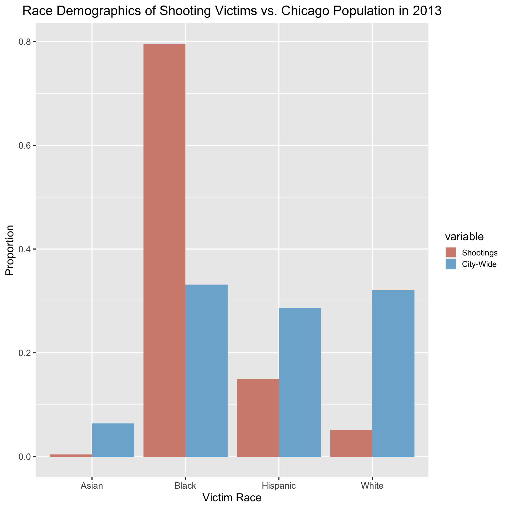
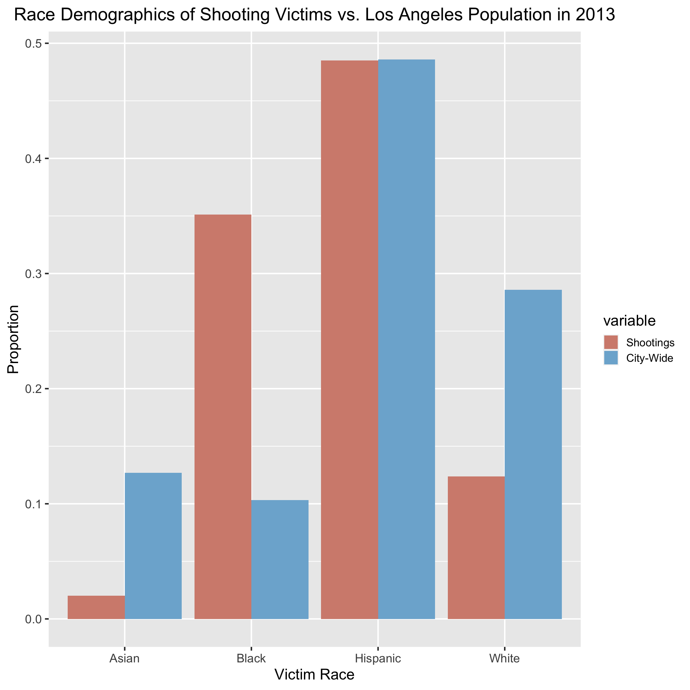
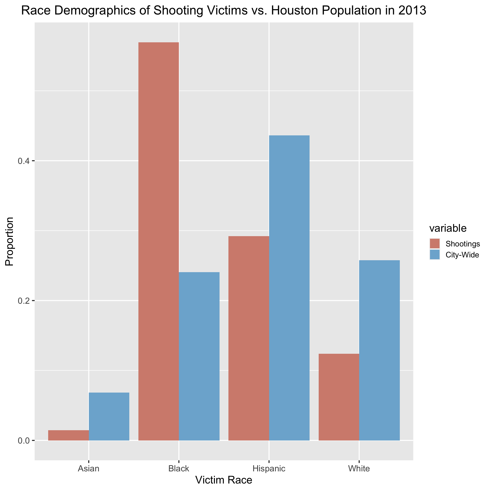
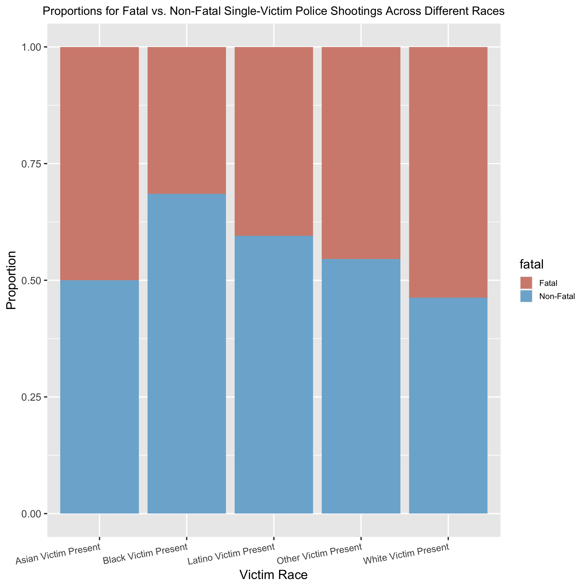
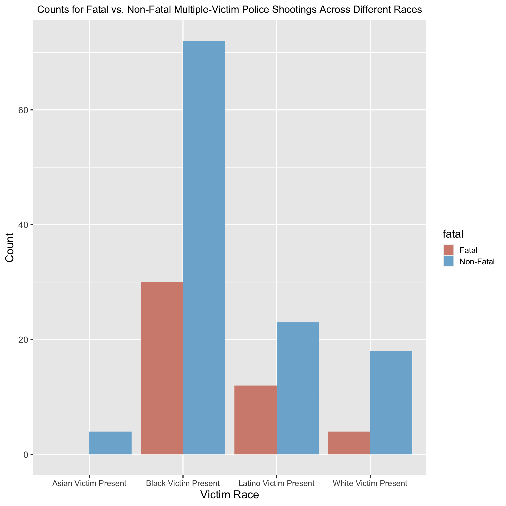
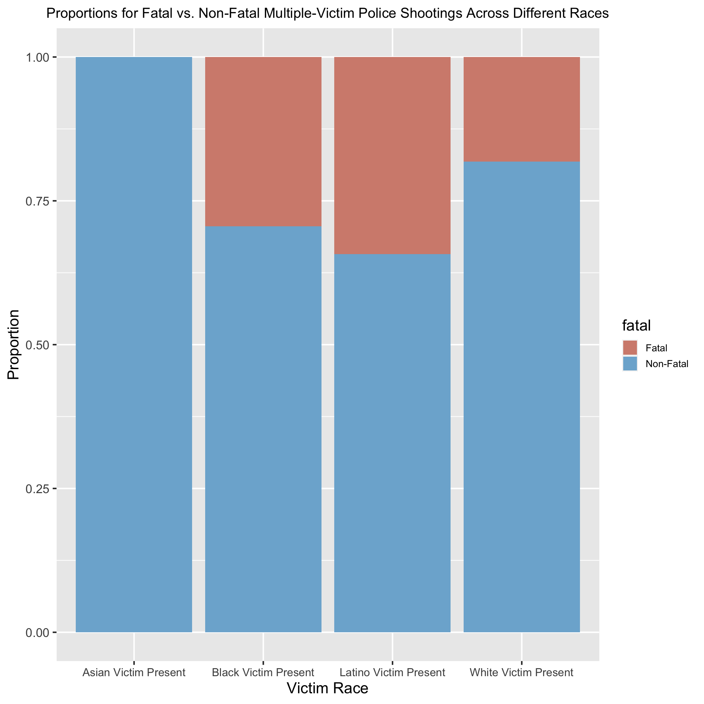
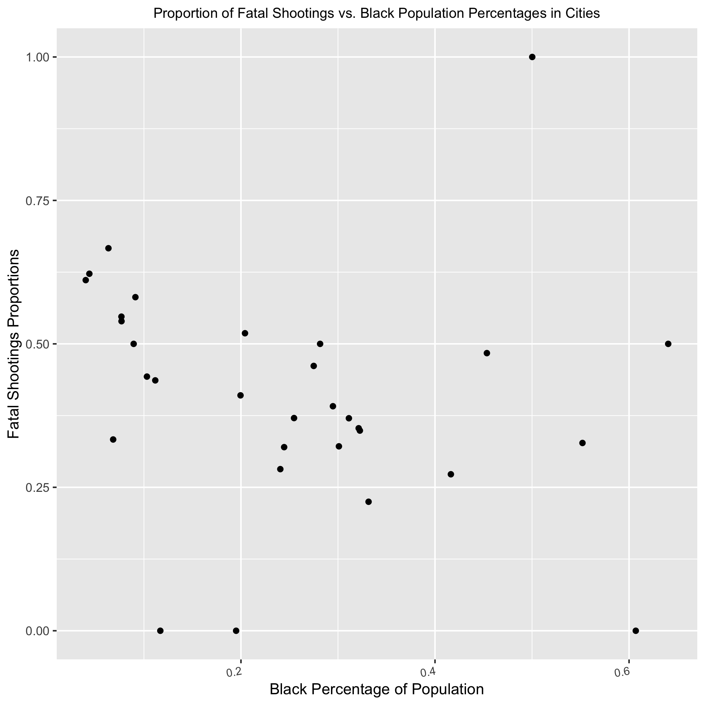
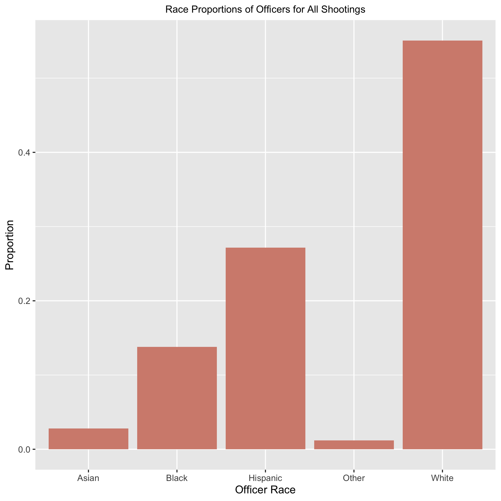

```{r setup, include = FALSE}
knitr::opts_chunk$set(echo = FALSE, warning = FALSE, message = FALSE)
```

```{r}
library(ggplot2)
library(dplyr)
library(tidyr)
library(tidyverse)
library(knitr)
library(lme4)
library(caret)
library(groupdata2)
```

```{r load-data}
final_df <- readRDS("data/final.rds")

# Combining Asian and Other so model will converge
final_df$SubjectRace[final_df$SubjectRace == "A"] <- "O"
final_df$OfficerRace[final_df$OfficerRace == "A"] <- "O"

final_df <- final_df %>% 
  mutate(so = as.numeric(str_count(final_df$SubjectRace, "O|A") > 0),
         oo = as.numeric(str_count(final_df$OfficerRace, "O|A") > 0)) %>% 
  select(-c(sa, oa))

single_victims <- final_df %>% 
  filter(NumberOfSubjects <= 1) %>% 
  mutate(SubjectRace = relevel(as.factor(SubjectRace), "W"))

mult_victims <- final_df %>% 
  filter(NumberOfSubjects > 1)
```

```{r}
crossvalidate <- function(data, k, model, dependent, random = FALSE){
  # 'data' is the training set with the ".folds" column
  # 'k' is the number of folds we have
  # 'model' is a string describing a linear regression model formula
  # 'dependent' is a string with the name of the score column we want to predict
  # 'random' is a logical; do we have random effects in the model?
  
  # Initialize empty list for recording performances
  performances <- c()
  
  # One iteration per fold
  for (fold in 1:k){
    
    # Create training set for this iteration
    # Subset all the datapoints where .folds does not match the current fold
    training_set <- data[data$.folds != fold,]
    
    # Create test set for this iteration
    # Subset all the datapoints where .folds matches the current fold
    testing_set <- data[data$.folds == fold,]
    
    ## Train model

    # If there is a random effect,
    # use glmer() to train model
    # else use glm()

    if (isTRUE(random)){
      # Train linear mixed effects model on training set
      m <- glmer(model, training_set, family = "binomial", control=glmerControl(optimizer="bobyqa",optCtrl=list(maxfun=2e5)))
    } else {
      # Train linear model on training set
      m <- glm(model, training_set, family = "binomial", control=glm.control(maxit=50))
    }

    ## Test model

    # Predict the dependent variable in the testing_set with the trained model
    predicted <- predict(m, testing_set, type="response", allow.new.levels = TRUE)
    fit.convert <- ifelse(predicted < 0.5, 0, 1)
    table(fit.convert, testing_set[[dependent]])
    performances[fold] <- mean(fit.convert == testing_set[[dependent]])
  }

  return(performances)
}
```

```{r}
getAccuracy <- function(v) {
  if (length(v) == 4) {
      return(((v[1] + v[4])/sum(v)) * 100)
  }
  if (length(v) == 2) {
    return((v[1]/sum(v)) * 100)
  }
}
```

## I. Introduction

|        On May 25, 2020, George Floyd was publicly suffocated to death by police officers in Minneapolis, Minnesota. This, along with the murder of Breonna Taylor by Louisville police, incited waves of protests against police brutality across the United States and increased the spread of Black Lives Matter content on social media. The recent boost in attention to the Black Lives Matter movement has once again brought to light the issue of racism in America and its link to police brutality, and more specifically, police use of deadly force. Several studies have already found that race does play a part in who is targeted and killed in police shootings. For example, in a recent VICE News investigation about police shootings, it was found that “Black people were shot more often and at higher rates than people of any other race.” [1] Additionally, Edwards et. al performed a study regarding the effects of age, race-ethnicity, and sex on the risk of being killed by lethal force by law enforcement and similarly found that "Black men are about 2.5 times more likely to be killed by police over the life course than are white men" while "Black women are about 1.4 times more likely to be killed by police than are white women." [2] However, even with these studies and their disturbing conclusions, a poll done by AP-NORC in June 2020 found that still 39% of Americans think that police are not more likely to use lethal force against a Black person than a White person. [3] Although this has decreased from an overwhelming 51% in June 2015, there is still a great deal of research that needs to be done in this area to provide more statistical evidence backing the relationship between racism and police use of deadly force. 

|        As a result, I have decided to build off of VICE News’ study and investigate data on police shootings further to understand the roles that the race of both victim and officer, as well as other factors such as whether they are carrying a weapon and the total number of victims in the crime, play in fatal versus non-fatal police shootings. Additionally, to account for the varying locations of the homicides, I will be using a dataset found on Kaggle detailing the gun provisions that are upheld by each state see how gun legislation affects lethal vs. non-lethal shootings. I will also add a predictor indicating whether the state in which the homicide occurred requires de-escalation training for police officers. Finally, I will explore how the race demographics of each location relates to police use of deadly force. This will allow me to better understand how racism has manifested itself in America’s police system and determine whether current attempts to prevent police use of lethal force are effective or not.

## II. Data

|        As a basis for this study, I will be using the same dataset that VICE News used. This dataset contains data on officer-involved shootings from 47 of the largest local police departments in America, and more specifically, “information on 4,117 incidents and 4,400 subjects [(victims)] over seven years.” [1] VICE News provides 34 variables in the dataset, including dates ranging from January 2010 to September 2016, 47 unique cities, subject race, subject gender, office race, officer gender, the type of weapon the subject was carrying, and whether the shooting was fatal or not. Race was broken up into 6 categories: White (non-Hispanic) (represented as W), Black (non-Hispanic) (B), Asian (A), Latino (L), Other (O), and Unknown (U). Gender was broken up into 3 categories: Male (M), Female (F), and Unknown (U). Weapon type was broken up into 5 values: "gun", "knife", "replica", "other", and "unknown". Additionally, there were cases in which multiple victims and/or multiple officers were present in the shooting. Each of these scenarios was still represented within one row of the dataset, but semi-colons were present in the respective victim and officer columns, separating each individual's information from each other.

|       Additionally, to assess the effect of different types of legislation on fatal vs. non-fatal police shootings in various states, I will be using a dataset from Kaggle containing 135 variables that detail whether a certain gun provision is absent or present in a certain year and U.S. state for 133 different gun provisions. [4] The years range from 1991 to 2017, and the gun provisions address 14 categories, some of which are dealer regulations, buyer regulations, prohibitions for high-risk gun possession, background checks, ammunition regulations, possession regulations, concealed carry permitting, assault weapons and large-capacity magazines, child access prevention, gun trafficking, and domestic violence. A 1 in the gun provision column represents a presence of the law, and a 0 indicates an absence. I will also add a column to this gun provision dataset indicating whether a state requires de-escalation training based off of information reported by APM Report in 2017, with a 1 meaning the state does require training and a 0 meaning the state does not. There were 16 states that required de-escalation training as of November 2017. [5] 

|       Finally, to examine city demographics as a predictor, I will be using population data from the 2013 American Community Survey that VICE News had already cleaned and standardized to the shootings dataset, meaning the city names can be matched up between the two datasets. VICE News most likely provided only 2013 census data because it is the average year of all the years represented in the shootings dataset. Furthermore, using census data only from 2013 requires that we analyze this data under the assumption that there is no drastic difference in population demographics between 2010 and 2016. The census data includes 7 variables: the police department and the city it's located in, as well as the city's Black, Asian, Hispanic, White, and overall total population in 2013. 

### Data Processing 

|        Although the VICE News dataset was already relatively clean with regards to the victim's data, there was still quite a bit of cleaning that needed to be done for the race and gender data of the officers. To clean these columns, I replaced all values that were not "W", "B", "A", "O", or "U" in the race column with the most informed guess that I could make about what the values represented. For example, "A/PI" values were taken to represent Asian/Pacific Islander and thus were replaced with "A", and "A/W" or other values with a "/" in them were typically taken to represent multi-racial individuals and as a result were replaced with "O." Similar procedures were carried out in the gender column for officers for values that were not "M", "F", or "U".

|        After this initial cleaning, I created new columns in the same dataset that represented whether any victims of race Black, White, Asian, or Other were present in the crime, respectively, and if any male or female victims were present in the crime, respectively. I also added new columns to represent the same information for officers (for each race and gender, whether each was present), and a new column to represent whether any victim involved in the shooting was shot fatally. Additionally, I made sure that each weapon type had its own column. All of these added columns had values of either 0 or 1, with 0 representing an absence of the variable and 1 a presence. Finally, I filtered out 2,063 rows that had only unknown and NA values for the fatality of the shooting or the races or genders of the victims or officers, as these rows did not provide sufficient information for my analysis, and I selected only the columns I needed, such as whether any victim of the shooting was shot fatally or not, the genders and races of the victims and officers, and the weapons that the victims were carrying, if any.

|        For the gun provisions dataset, I created a new column that sums up the total number of laws listed in the dataset that each state had in 2013 (for the same reason that VICE News used 2013). Additionally, as I mentioned earlier, I appended a column to this dataset representing whether a state requires de-escalation training for police officers as of November 2017. 2017 was used under the assumption that no major event occurred between September 2016 and November 2017 that caused a sudden increase in the number of states that require de-escalation training for police officers. Finally, for the census data, the only cleaning that needed to be done was extracting the state that each city was in from the department column so that the census could be easily joined with the cleaned shootings dataset by city name, as well as the gun provisions dataset by abbreviated state name. 

|        After merging the three datasets, the final dataset consists of 2,054 observations.

### Exploratory Data Analysis

```{r, figures-city1, fig.show="hold", out.width="50%"}
par(mar = c(2, 2, .1, .1))


```

```{r, figures-city2, fig.show="hold", out.width="50%", fig.cap="Race Proportions of Shooting Victims vs. City Population Demographics of the Most Popular 4 Cities in the Data"}
par(mar = c(2, 2, .1, .1))

knitr::include_graphics("figures/cityeda4.png")
```
|       Plotted above in \emph{Figure 1} are the race proportions of shooting victims in the top 4 most popular cities in the dataset (Chicago, Los Angeles, Houston, and Phoenix) vs. the race proportions of those cities' total populations in 2013. Because the bars representing shootings in the Black race category are taller than the bars representing city-wide population in all 4 plots, it is evident Black people are disproportionately the victims of police shootings compared to city race proportions. This can especially be seen in Houston, where Black people make up less than 25% of the city population yet more than 50% of the victim population of police shootings.
```{r num_rows, eval = F}
final_eda <- readRDS('data/final_eda.rds')

single_victims <- final_eda %>% 
  filter(NumberOfSubjects <= 1)
nrow(single_victims)

mult_victims <- final_eda %>% 
  filter(NumberOfSubjects > 1)
nrow(mult_victims)
```

```{r, figures-single, fig.show="hold", out.width="50%", fig.cap="Counts (left) and Proportions (right) of Different Races Across Single Victim Shootings"}
par(mar = c(2, 2, .1, .1))
knitr::include_graphics("figures/singleeda1.png")

```

```{r, figures-mult, fig.show="hold", out.width="50%", fig.cap="Counts (left) and Proportions (right) of Different Races Across Multiple Victim Shootings"}
par(mar = c(2, 2, .1, .1))


```

|       Additionally, there appears to be 1,906 incidents in the final dataset in which there was only one victim, and 148 with multiple victims. Among all shootings with only one victim, it appears in \emph{Figure 2} that the victim is more often Black than some other race. However, it seems that Black victims and most victims of the other race types are more likely to be shot non-fatally than fatally, whereas White victims seem more likely to be shot fatally. Finally, it is important to note that the numbers of victims that are of race types Asian and Other are relatively small. Because of this, we will combine Asian and Other race types into one single race category called "Other" for both officers and victims for our models.

|       Similarly, as seen in \emph{Figure 3}, Black victims make up the highest proportion of victims in shootings with multiple victims. However, in these shootings, all race types are more likely to be shot non-fatally than fatally, with Latinos having the highest proportion of being shot fatally out of all other race types. Additionally, it should be noted that there are no victims with race type "Other" in shootings where there are multiple victims. 

## III. Methods

|        Because I want to explore the relationship between the number of victims in a police shooting affects and whether the shooting is fatal or not, I decided to create two separate models: one for shootings with only one victim, and one for shootings with multiple victims. Both models are random effect logistic regression models because the range that the response variable can take in logistic regression is the most reasonable given that I am predicting whether a victim is shot fatally or not (labeled 1 and 0, respectively). Additionally, I will be using random effects to control for correlation within cities. 

|        To create these two models, I first performed backwards selection using simple logistic regression models on all relevant predictors in order to get a sense of which predictors are most statistically significant in prediction shooting fatality. Then, I added potential interactions that I wanted to explore one at a time and performed likelihood ratio tests with each new model iteration to check if the added interaction improved the previous model. Whether an interaction was statistically significant or not was determined by whether the likelihood ratio test's p-value was less than 0.05. Finally, I put these variables obtained from backwards selection into a random effects linear regression model with city as the random intercept and evaluated the fit of this model using cross validation, which I will describe in more detail in the Results section. From there, I tweaked the model by experimenting with additional predictors, interactions, and random effects between city and other predictors in order to obtain the best fitting model.

|        The final model for single-victim shootings is written out below (where $p_i$ represents the probability of getting fatally shot for shooting $i$):
```{r, eval = F}
rand_fit2 <- glmer(fatal ~ SubjectRace + ob + ow + omult + gun + weapon_other + replica + knife + (SubjectRace | city), data = single_victims, family = "binomial", control=glmerControl(optimizer="bobyqa",optCtrl=list(maxfun=2e5)))
```

\begin{center}
$$
log(\frac{p_i}{(1-p_i)}) = \beta_0 + \beta_{1j}\ VictimRace_{ij} + \beta_2\ OfficerBlack_i + \beta_3\ OfficerWhite_i + \beta_4\ MultipleOfficers_i
$$
$$
+ \beta_5\ VictimWithGun_i + \beta_6\ VictimWithOther_i + \beta_7\ VictimWithReplica_i + \beta_8\ VictimWithKnife_i
$$
$$
 + \beta_9\ VictimUnarmed_i + b_i
$$
$$
b_i \sim N(0, \sigma_b^2)
$$
$$
VictimRace = \text{{White*, Black, Latino, Other}}
$$
\end{center}
|        For single victims, the best fitting model was the one that used city as a random intercept and had random slopes for the SubjectRace in each of these cities. 

|        The final model for multiple-victim shootings is written out below (where $p_i$ represents the probability of getting fatally shot for shooting $i$):

```{r mult-fit, eval=F}
rand_fitm <- glmer(fatal ~ sb + sl + so + ob + ol + omult + gun + knife + weapon_other + replica + I(black/white) + (1 + sb + sl | city), data = mult_victims, family = "binomial", control=glmerControl(optimizer="bobyqa",optCtrl=list(maxfun=2e5)))
```
\begin{center}
$$
log(\frac{p_i}{(1-p_i)}) = \beta_0 + \beta_{1j}\ VictimBlack_{ij} + \beta_{2j}\ VictimLatino_{ij} + \beta_3\ VictimOther_i
$$
$$
+ \beta_4\ OfficerBlack_i + \beta_5\ OfficerLatino_i + \beta_6\ MultipleOfficers_i + \beta_7\ VictimWithGun_i
$$
$$
\beta_8\ VictimWithOther_i + \beta_9\ VictimWithReplica_i + \beta_{10}\ VictimWithKnife_i + \beta_{11}\ (\frac{black_i}{white_i}) + b_i
$$
$$
b_i \sim N(0, \sigma_b^2)
$$
\end{center}
|        For multiple victims, the best fitting model was the one that used city as a random intercept and had random slopes for whether a Black victim was present and whether a Latino victim was present in the shootings in each of these cities. It is important to note that none of the legislative predictors were useful in predicting the odds of someone being fatally shot in police shootings in either model. Additionally, $\frac{black_i}{white_i}$ refers to the proportion of black to white people in a city. This proved to be useful in increasing the predictive accuracy of the model.

## IV. Results

### Single Victims Model

```{r single random effects}
rand_fit2 <- glmer(fatal ~ SubjectRace + ob + ow + omult + gun + weapon_other + replica + knife + (SubjectRace | city), data = single_victims, family = "binomial", control=glmerControl(optimizer="bobyqa",optCtrl=list(maxfun=2e5)))
kable(summary(rand_fit2)$coefficients)
```

|        In this single victim model, the $\beta_0$ coefficient, which has a value of -0.57, represents the log odds of being fatally shot by police in a 'typical' scenario and city. 'Typical' can be defined as a shooting in which the victim is White and unarmed and there is only one officer present, who is neither Black nor White. Thus, $\beta_0 + b_i$, or the city-specific intercept, represents the log odds of being fatally shot for a 'typical' White, unarmed victim in city $i$ when there is only one officer present, who is neither Black nor White. The variabilities of the intercepts and slopes across different cities and different race groups within cities are all greater than 0, indicating that there is enough variation in the baseline odds of being shot fatally in different cities and different race groups within cities. From the fixed effect coefficients, we can see that generally, all other race types are less likely to be shot fatally than White 'typical' individuals. 

|        The `ranef` function allows us to further quantify the difference between the average predicted log odds of being fatally shot for the general population versus that of a specific city and subject race type, other predictors remaining unchanged. This can be found in the Appendix. From this table, we can see that the city with the highest baseline odds of being shot fatally is Albuquerque, whereas the city with the lowest baseline odds of being shot fatally is Chicago. For White people in Chicago, the predicted log odds of being shot fatally is 0.76 less than that of in a 'typical' scenario and city. However, for Black people in Chicago, the predicted log odds of being shot fatally is actually 0.28 higher than that of a 'typical' scenario and city. In contrast, for Latino people in Chicago, the predicted log odds of being shot fatally is 0.23 lower than that of a 'typical' scenario and city, and for people of other race types in Chicago, the predicted log odds of being shot fatally is 2.86 lower than that of a 'typical' scenario and city. We can conclude that in Chicago, Black people are disproportionately shot fatally in police shootings. In Albuquerque, the trend is almost opposite: for Black people, the log odds of being shot fatally is 0.43 less than that of a 'typical' scenario and city, whereas for White people, the log odds of being shot fatally is 0.67 more. Overall, we can conclude that city plays a large role in whether a race type is fatally shot in police shootings, although the general trend is that White people are most likely to be shot fatally than other race types.

### Multiple Victims Model

```{r mult random effects}
rand_fitm <- glmer(fatal ~ sb + sl + so + ob + ol + omult + gun + knife + weapon_other + replica + I(black/white) + (1 + sb + sl | city), data = mult_victims, family = "binomial", control=glmerControl(optimizer="bobyqa",optCtrl=list(maxfun=2e5)))
kable(summary(rand_fitm)$coefficients)
kable(ranef(rand_fitm))
```

|        In this multiple victims model, the $\beta_0$ coefficient, which has a value of -1.77, represents the log odds of being fatally shot by police in a 'typical' scenario and city. 'Typical' can be defined as a shooting in which the victim is White and unarmed and there is only one officer present, who is neither Black nor Latino. Thus, $\beta_0 + b_i$, or the city-specific intercept, represents the log odds of being fatally shot for a 'typical' White, unarmed victim in city $i$ when there is only one officer present, who is neither Black nor White. The variabilities of the intercepts and slopes across different cities and different race groups within cities are all greater than 0, indicating that there is enough variation in the baseline odds of being shot fatally in different cities and different race groups within cities. From the fixed effect coefficients, we can see that generally, all other race types are less likely to be shot fatally than White 'typical' individuals. 

|        The `ranef` function also allows us to quantify the difference between the average predicted log odds of being fatally shot for the general population versus that of a specific city and subject race type, other predictors remaining unchanged. This can be found in the Appendix. From this table, we can see that the city with the highest baseline odds of being shot fatally is Albuquerque, whereas the city with the lowest baseline odds of being shot fatally is Chicago. For White people in Chicago, the predicted log odds of being shot fatally is 0.76 less than that of in a 'typical' scenario and city. However, for Black people in Chicago, the predicted log odds of being shot fatally is actually 0.28 higher than that of a 'typical' scenario and city. In contrast, for Latino people in Chicago, the predicted log odds of being shot fatally is 0.23 lower than that of a 'typical' scenario and city, and for people of other race types in Chicago, the predicted log odds of being shot fatally is 2.86 lower than that of a 'typical' scenario and city. We can conclude that in Chicago, Black people are disproportionately shot fatally in police shootings. In Albuquerque, the trend is almost opposite: for Black people, the log odds of being shot fatally is 0.43 less than that of a 'typical' scenario and city, whereas for White people, the log odds of being shot fatally is 0.67 more. Overall, we can conclude that city plays a large role in whether a race type is fatally shot in police shootings, although the general trend is that White people are most likely to be shot fatally than other race types.

### Differences Between Single and Multiple Victims

### Model Validation and Diagnostics

|        As I mentioned earlier, I performed 5-fold cross-validation on my models to assess model accuracy and fit. I chose to use 5 folds and 85% of the data because this is commonly used in practice, but I tried it with 90% of the data as well just to verify that my cross-validation technique was not biased for the percentage of the full data allocated for the training set. I used the `groupdata2` R package to partition our data set so that the training set contained 85% of the data from the full dataset, and then I ran 5-fold cross-validation on this training set before predicting on the test set. When assessing the performance of different models, we considered a higher average cross-validation and test set prediction accuracy to be indicative of a better model. For the single victims model, I achieved an average 5-fold cross-validation prediction accuracy of 0.66 and a test set prediction accuracy of 0.70. For the multiple victims model, I achieved an average 5-fold cross-validation prediction accuracy of 0.61, and a test set prediction accuracy of 0.63.

### Sensitivity Analysis


## V. Discussion and Conclusion

|        Overall, 
|        One strength of my analysis is that I am considering many variables as predictors, from individual level data to contextual predictors, such as state gun legislation. This allows me to thoroughly explore and determine whether the relationships between a wide range of potential predictors and police shooting fatality in the context of police brutality are significant in any types of shootings (single vs. multiple victims, for example). There are several limitations to this study. For example, the VICE News dataset spans over the years 2010 to 2016, and neither of my models will be exploring time series data whatsoever. Thus, the aspect of time may be playing some sort of effect on my response variable that I am not accurately capturing in my models. There are also several other confounding factors that have not been accounted for, such as how well one can shoot at baseline or what training they have received with regards to shooting. Additionally, when cleaning the data, there were several "Unknown" values in the fatality column. Unknown values were assumed to represent "No" in this study, although this may not necessarily be true, to allow for more straightforward cleaning of the data and not lose too many observations in the data. Finally, there were less than 200 cases in which there were multiple victims in my final dataset, which is a relatively small sample size. Thus, it may be necessary to take the results from the multiple-victim model with a grain of salt.


## VI. References 

[1] McCann, Allison, et al. “Police Shoot Far More People than Anyone Realized, a VICE News Investigation Reveals.” VICE News, VICE News, 12 Dec. 2017, news.vice.com/en_us/article/xwvv3a/shot-by-cops. 

[2] Edwards, Frank, et al. “Risk of Being Killed by Police Use of Force in the United States by Age, Race–Ethnicity, and Sex.” PNAS, PNAS, 20 Aug. 2019, www.pnas.org/content/116/34/16793. 

[3] Press, Associated. “Sweeping Change In US Views Of Police Violence, New Poll Finds.” KPBS Public Media, KPBS, 18 June 2020, www.kpbs.org/news/2020/jun/18/sweeping-change-us-views-police-violence-new-poll-/. 

[4] https://www.kaggle.com/jboysen/state-firearms

[5] Gilbert, Curtis. “Most States Neglect Ordering Police to Learn De-Escalation Tactics to Avoid Shootings.” Not Trained to Not Kill | APM Reports, APM Reports, 16 Sept. 2020, www.apmreports.org/story/2017/05/05/police-de-escalation-training.

[6] DeGue, Sarah et al. “Deaths Due to Use of Lethal Force by Law Enforcement: Findings From the National Violent Death Reporting System, 17 U.S. States, 2009-2012.” American journal of preventive medicine vol. 51,5 Suppl 3 (2016): S173-S187. doi:10.1016/j.amepre.2016.08.027

## VII. Appendix

```{r, figures-btw, out.width="50%", fig.cap="Proportion of Fatal Shootings vs. Black to White Ratios in Cities in Dataset (left) and vs. Black Population Percentages in Cities in Dataset (right)"}
par(mar = c(2, 2, .1, .1))
knitr::include_graphics("figures/btweda.png")

```

```{r, figures-officersbprop, out.width="50%", fig.cap="Race Proportions of Officers For All Shootings (left) and For Fatal vs. Non-Fatal Police Shootings Where At Least One Black Victim was Present (right) and "}
par(mar = c(2, 2, .1, .1))

knitr::include_graphics("figures/officerpropsb.png")
```

```{r single and mult}
single_victims <- final_df %>% 
  filter(NumberOfSubjects <= 1)

mult_victims <- final_df %>% 
  filter(NumberOfSubjects > 1)
```

#### Single-Victim Shooting
```{r single fit}
rand_fit2 <- glmer(fatal ~ SubjectRace + ob + ow + omult + gun + weapon_other + replica + knife + (SubjectRace | city), data = single_victims, family = "binomial", control=glmerControl(optimizer="bobyqa",optCtrl=list(maxfun=2e5)))
kable(ranef(rand_fit2), caption = "Random Effects Coefficients for Single-Victim Shootings")
```

#### Multiple-Victim Shooting
```{r mult fit}
rand_fitm <- glmer(fatal ~ sb + sl + so + ob + ol + omult + gun + knife + weapon_other + replica + I(black/white) + (1 + sb + sl | city), data = mult_victims, family = "binomial", control=glmerControl(optimizer="bobyqa",optCtrl=list(maxfun=2e5)))
kable(ranef(rand_fitm), caption ="Random Effects Coefficients for Multiple-Victim Shootings")
```
```{r validate rand_fit2}
set.seed(1)

Train <- createDataPartition(mult_victims$fatal, p=0.85, list=FALSE)
training <- single_victims[ Train, ]
testing <- single_victims[ -Train, ]

data <- fold(
  training,
  k = 5
) %>%
  arrange(.folds)

m0 <- 'fatal ~ sb + sl + so + ob + ol + omult + gun + knife + weapon_other + replica + I(black/white) + (1 + sb + sl | city)'
p0 <- crossvalidate(data, k = 5, model = m0, dependent = 'fatal', random = TRUE)
paste0("Average cross-validation prediction accuracy: ", mean(p0))

rand_fitm <- glmer(m0, training, family = "binomial", control=glmerControl(optimizer="bobyqa",optCtrl=list(maxfun=2e5)))
preds <- predict(rand_fitm, testing, type = "response", allow.new.levels=TRUE)
fit.convert <- ifelse(preds < 0.5, 0, 1)
kable(table(fit.convert, testing[['fatal']]))
m <- mean(fit.convert == testing[['fatal']])
paste0("Test set prediction accuracy: ", m)
```


